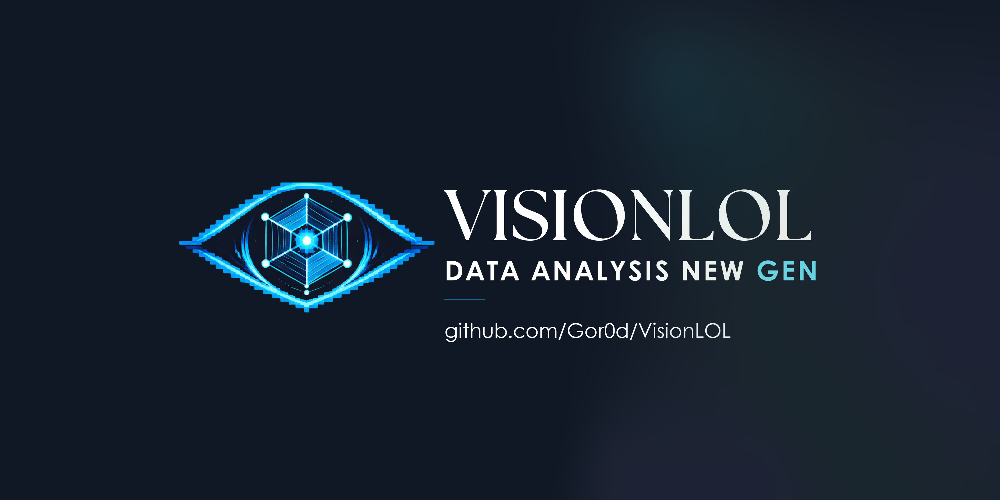
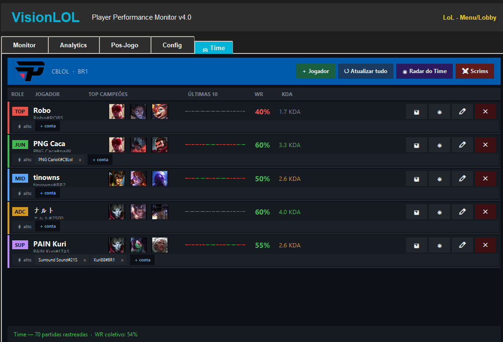
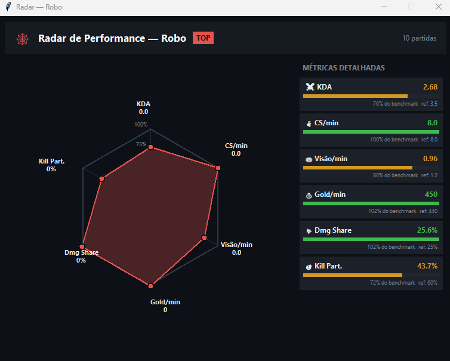
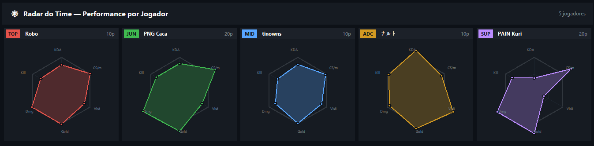
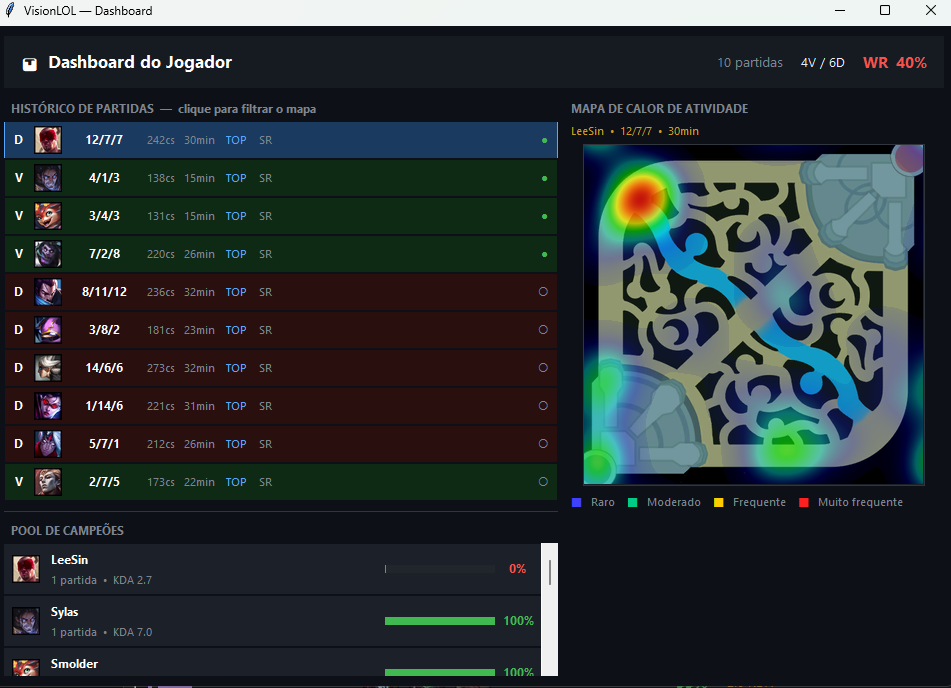
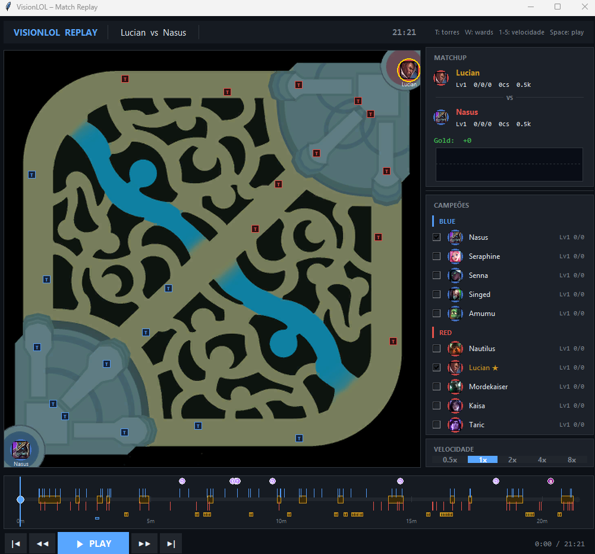
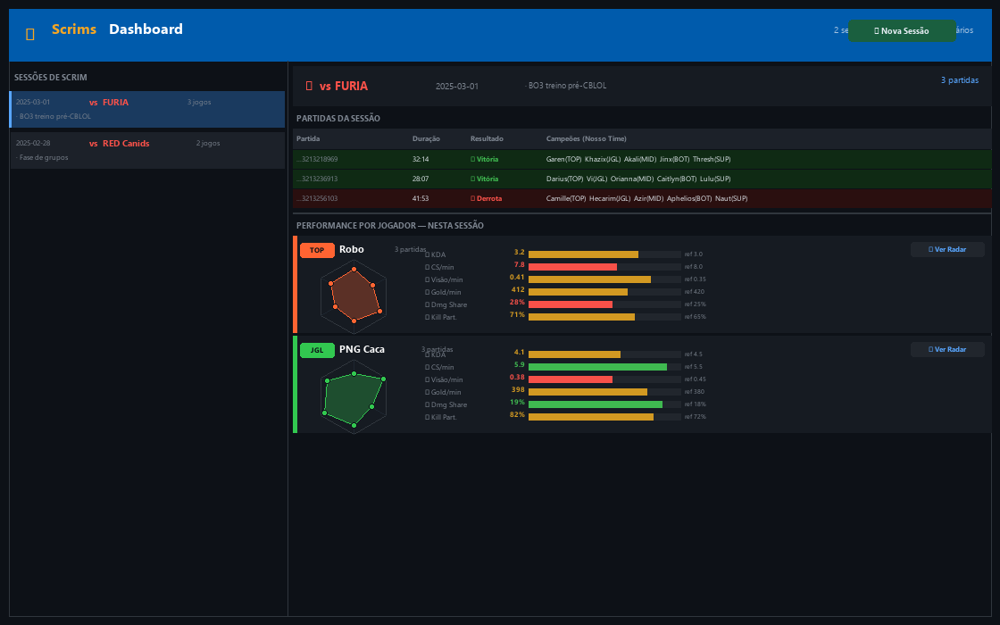

<p align="center">
  
</p>

Ferramenta de análise e monitoramento de performance para times de League of Legends.
Integração completa com a Riot Games API para acompanhamento de soloq, scrims e estatísticas individuais.



---

## Funcionalidades

### Roster do Time
- Gerenciamento de 5 jogadores com roles (TOP / JG / MID / ADC / SUP)
- Suporte a múltiplas contas por jogador (smurfs / alts)
- Stats agregadas de todas as contas: WR%, KDA médio, top campeões e histórico das últimas partidas
- Indicador ao vivo — detecta se o jogador está em partida no momento



### Radar de Performance

- 6 métricas normalizadas por role: KDA · CS/min · Visão/min · Gold/min · Damage Share · Kill Participation
- Benchmarks por role (TOP/JGL/MID/ADC/SUP) baseados em padrão pro/soloq alto
- Radar individual por jogador e visão geral do time em grid



### Dashboard de Partidas

- Histórico detalhado das últimas partidas
- Pool de campeões com WR% e KDA por campeão
- Mapa de calor de atividade (heatmap) por partida, gerado a partir das timelines



### Replay Viewer

- Visualização quadro a quadro das posições dos jogadores no mapa
- Rastreamento de abates, objetivos e estruturas destruídas
- Análise de ward lifetimes e movimentação por lane



### Scrims Dashboard

- Registro e acompanhamento de sessões de scrim contra outros times
- Comparativo de métricas por partida e por jogador



---

## Instalação

### Requisitos

- Python 3.10+
- Chave de API da Riot Games (ver abaixo)

### Passos

```bash
# 1. Clone o repositório
git clone https://github.com/Gor0d/VisionLOL.git
cd VisionLOL

# 2. Crie e ative o ambiente virtual
python -m venv .venv
# Windows:
.venv\Scripts\activate
# Linux/macOS:
source .venv/bin/activate

# 3. Instale as dependências
pip install -r requirements.txt

# 4. Configure a API key
cp config.example.json config.json
# Edite config.json e insira sua Riot API key
```

### Dependências principais

```
Pillow
requests
numpy
opencv-contrib-python
pynput
psutil
```

---

## Configuração da Riot API Key

1. Acesse [developer.riotgames.com](https://developer.riotgames.com)
2. Faça login com sua conta Riot
3. Gere uma **Development API Key** (válida por 24h) ou solicite uma **Personal/Production Key**
4. Cole a chave no `config.json`:

```json
{
    "riot_api_key": "RGAPI-sua-chave-aqui",
    "game_name": "SeuNomeIngame",
    "tag_line": "BR1",
    "region": "br1",
    "routing": "americas",
    "proximity": {
        "poll_interval": 0.5,
        "gank_distance": 2000,
        "gank_duration": 5.0
    },
    "auto_start_riot_tracking": true
}
```

> **Regiões disponíveis**
> | Servidor | `region` | `routing` |
> |----------|----------|-----------|
> | Brasil | `br1` | `americas` |
> | NA | `na1` | `americas` |
> | EUW | `euw1` | `europe` |
> | KR | `kr` | `asia` |

---

## Uso

```bash
python gui_app_integrated.py
```

Na aba **Time**, configure o roster com os Riot IDs dos jogadores (formato `NomeIngame#TAG`).
Os dados são carregados automaticamente da API.

---

## Estrutura do Projeto

```
VisionLOL/
├── instant_start.py          # Ponto de entrada principal
├── gui_app_integrated.py     # GUI principal (notebook com abas)
├── config.example.json       # Template de configuração (copie para config.json)
├── team_roster.json          # Roster do time (gerado automaticamente)
├── requirements.txt
│
├── docs/
│   └── screenshots/          # Imagens do README
│
└── riot_api/
    ├── config.py             # Endpoints da Riot API
    ├── riot_http.py          # Cliente HTTP com rate limiting
    ├── match_api.py          # Match-V5 + Account-V1 + Spectator-V5
    ├── map_visualizer.py     # Download e renderização do minimap
    ├── team_viewer.py        # Aba de roster do time
    ├── performance_radar.py  # Radar de performance (6 métricas)
    ├── dashboard_viewer.py   # Dashboard com heatmap
    ├── replay_viewer.py      # Replay quadro a quadro
    ├── replay_engine.py      # Motor de replay (timeline processing)
    ├── scrim_dashboard.py    # Dashboard de scrims
    ├── pathing_visualizer.py # Visualização de movimentação
    ├── proximity_tracker.py  # Rastreamento de proximidade
    └── reaction_analyzer.py  # Análise de tempo de reação
```

---

## Aviso Legal

VisionLOL não é endossado pela Riot Games e não reflete as opiniões da Riot Games ou de qualquer pessoa envolvida na produção ou gerenciamento de League of Legends. League of Legends e Riot Games são marcas registradas da Riot Games, Inc.

Este projeto usa a [Riot Games API](https://developer.riotgames.com/) e está sujeito à [Política de Uso da API da Riot](https://developer.riotgames.com/policies/general).

---

## Licença

[MIT](LICENSE)
